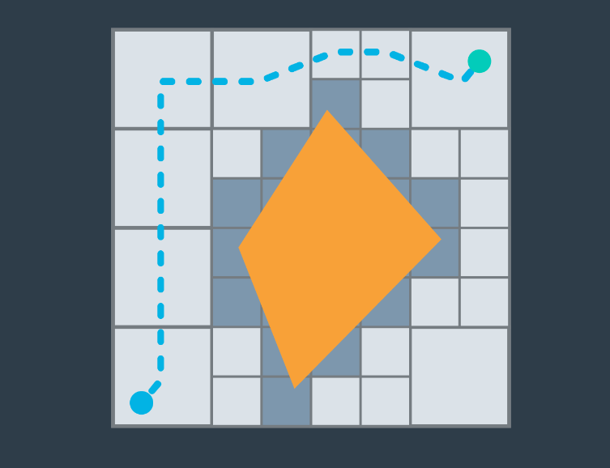
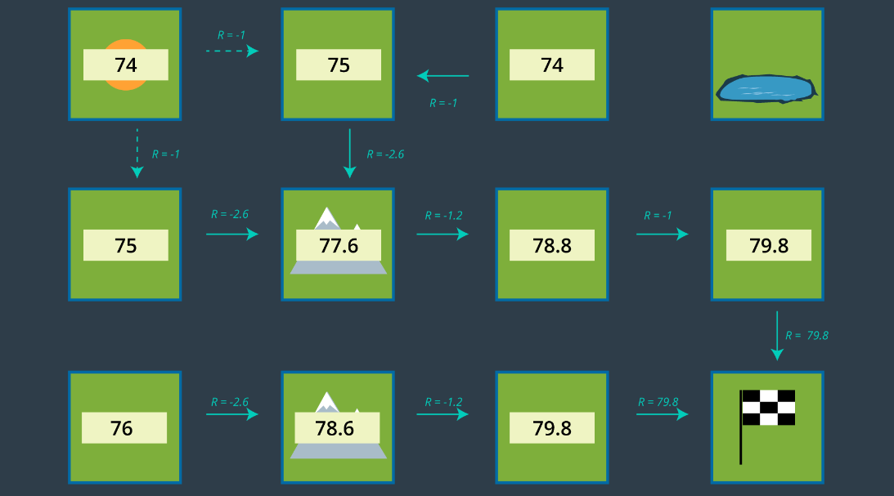

# Approaches to Path Planning

Three different approaches to path planning:

1. **Discrete (or Combinatorial) Path Planning:** This is the most straightforward of the three approaches.

2. **Sample-Based Path Planning**

3. **Probabilistic Path Planning**

Both **Sample-Based Path Planning** and **Probabilistic Path Planning** will build on the foundation of **Discrete Planning** to develop more widely applicable path planning solutions.

## Discrete Planning

Discrete planning involves the following key aspects:

1. **Discretization of Workspace**: Discrete planning explicitly discretizes the robot's workspace into a connected graph. 

2. **Graph Search Algorithm**: A graph-search algorithm is then applied to calculate the best path. 

Discrete planning is characterized by its precision, which can be adjusted by changing the level of discretization. However, this precision comes at the cost of being computationally expensive, especially for large path planning problems. It is best suited for low-dimensional problems. For high-dimensional problems, sample-based path planning is a more suitable approach.

The discrete planning process can be summarized in three steps:

1. Develop a continuous representation.
2. Discretize the configuration space.
3. Perform a graph search.

## Minkowski Sum

The Minkowski sum is a mathematical property used to compute the configuration space when given an obstacle geometry and robot geometry. It can be visualized by imagining painting the outside of an obstacle using a paintbrush shaped like your robot, with the robot's origin as the tip of the paintbrush.

## Sample-Based Planning

Sample-based path planning involves the following key characteristics:

- **Incremental Graph Construction**: Sample-based path planning probes the workspace incrementally to construct a graph.

- **Use of Samples**: Instead of discretizing every segment of the workspace, sample-based planning takes a limited number of samples and utilizes them to build a discrete representation of the workspace.

The resultant graph may not be as precise as one created using discrete planning, but it is significantly quicker to construct due to the relatively small number of samples used. In certain applications, generating a feasible path quickly can be more important than waiting for hours or even days to generate the optimal path.

Sample-based planning is a valuable approach when time and computational resources are limited, and the need for a feasible path outweighs the need for an optimal one.

## Probabilistic Path Planning

Probabilistic path planning focuses on addressing the uncertainty associated with a robot's motion during the path planning process. Unlike the first two approaches that tackle the path planning problem generically, probabilistic path planning considers the specific challenges related to the uncertainty of a robot's actions.

This approach may not always offer substantial advantages in all environments. However, it becomes particularly valuable in highly-constrained environments or situations where there are sensitive or high-risk areas to navigate through. In such cases, accounting for the uncertainty in the robot's motion can lead to safer and more reliable path planning solutions.

